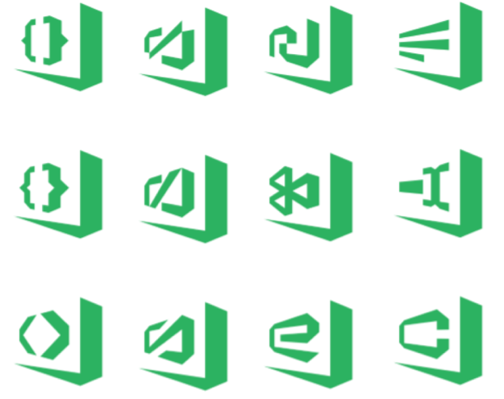
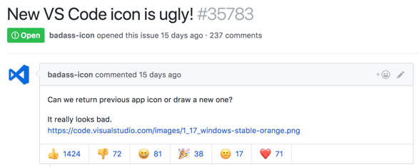
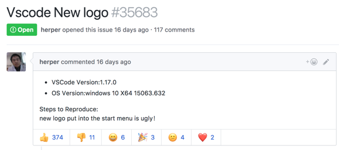
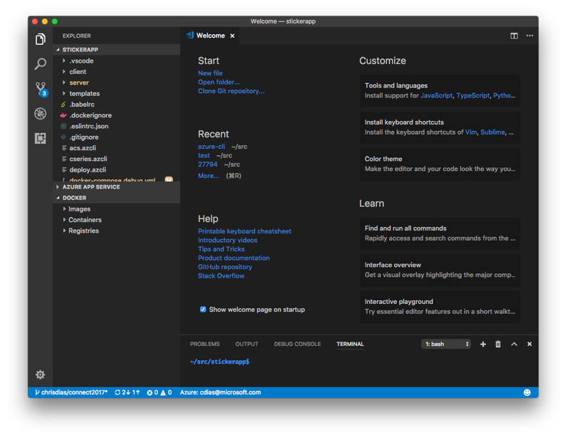
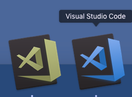

# The Icon Journey

October 24, 2017 Chris Dias, [@chrisdias](https://twitter.com/chrisdias)

## TL;DR

Thanks for all the passionate feedback. It has been very helpful, painful, and entertaining all at the same time. We're changing the orange icon to blue for Stable and keeping green for Insiders.

## What is your favorite color?

In [Monty Python and the Holy Grail](https://en.wikipedia.org/wiki/Monty_Python_and_the_Holy_Grail), the bridge keeper asks Sir Lancelot three questions before allowing him to cross the Bridge of Death. Answer all three correctly and Sir Lancelot can pass. Answer incorrectly and it's an untimely death. [Sir Lancelot answered blue when asked his favorite color and was allowed to cross](https://www.youtube.com/watch?v=qry9IeJnbNU).

We answered "orange".

## Apologies and Transparency

First, an apology for the delay in responding. We've been watching the feedback come in, we've read every single piece, and we've been having "lively" discussions on the next steps. We believe we have a rational plan and want to share it with you, and we look forward to a continuing dialog on what we now know is such a deeply controversial topic.

For complete transparency, we want to share some history as we think it helps to understand how we arrived at orange in the first place.

## Welcome to the family

Back in [March](https://blogs.msdn.microsoft.com/visualstudio/2017/03/08/iterations-on-infinity/), we (the broader Visual Studio team) set out to create a "family" feel across all of the developer tools we produce. If you read that blog post again, you can see that we had to work within a set of "challenging" corporate branding guidelines (for example, a single color).

It is easy to blame the guidelines, but at the same time, having a set of products that are easily and broadly recognizable is a valuable asset. Instead, we took on the challenge of working within the constraints while also working across the company to evolve the guidelines and address the problems we faced.

When we saw the negative feedback from the initial set of icons, we went heads down on the VS Code icon. We wanted to produce an icon that both the broad community and we would find instantly, visually, and emotionally appealing.

Here are some of the early designs:

None of these really stood out for us, except the one in the upper right corner.

This was rejected because it didn't contain any folds, which is a component of the family design. Back to the drawing board.

We iterated on the infinity logo for some time, for example:

Including one that will hurt your eyes:

Until we landed on the current "fish", which tested well with admittedly, a small number of developers.

## Rotation

We have a lot more design freedom on the macOS (and Linux), which is why we have a different icon there. While we wanted to keep the same icon shape, we were not limited to a single color and we could resolve contrast issues by mounting the icon on a dark panel. The rotation actually adheres to the [Apple design guidelines](https://developer.apple.com/macos/human-interface-guidelines/icons-and-images/app-icon).

That said, the feedback that the rotation is outdated and the mount makes the icon appear smaller than other icons in the Dock is completely fair.

## Fatigue

By mid-summer, icon fatigue rolled in. We had made so many iterations, we finally said let's go with the current shape, and we checked in the "pre-release" design for Insiders. A pre-release is denoted by the hashed box on the right and bottom:

The hash looks great at large sizes (for example on a PowerPoint slide), but at small sizes the box is very washed out and the icon becomes blurry.  We iterated on a number of outlines in white, black, and different shades of orange and green. Here they are enlarged to see the edges.

To combat this problem, we also tried the macOS version on Windows and that simply looked out of place, and even worse at small sizes. In the end, we decided to drop the pre-release design and use a different color for Insiders. Green was available, and it was the existing Insiders color, so we went with that.

Voila, Insiders:

## Icon Squatting

Before VS Code existed, there was [Visual Studio Online Monaco](https://azure.microsoft.com/en-us/resources/videos/building-web-sites-with-visual-studio-online-monaco/), which was our fully browser based workbench that lets you live edit your Azure App Service web apps. Since we were calling ourselves "Visual Studio Online" and needed an icon, we "borrowed" the blue infinity from Visual Studio Team Services.

When we first released VS Code, everything was happening so quickly, and the icon was the least of our concerns. Regardless of what you think about the new icon, [the old one looks pretty bad](https://github.com/Microsoft/vscode/issues/11274) on the desktop and in the Taskbar and Dock, it was really meant to be a favicon.

Later on, when we decided that each product in the family would have its own color, it made sense that VSTS would keep its blue and we'd have to come up with something else. Plus, we stole it from them, so it seemed right to give it back :).

## Pumpkin Spice

At this point, we pretty much ran out of colors in the family palette, except for the now infamous orange. There was some concern about the similarity to Sublime Text color palette, but no one had issues when we tested it. And quite honestly, we were more surprised by the latest Sublime's use of a folded ribbon.

## How to generate a lot of feedback...quickly

The Insiders builds had the orange and then green icons for about 2 months as we iterated on the problems outlined above, and there wasn't a lot of negative feedback coming in.

Maybe our fears were unfounded. Maybe users would really like the new icons and all the angst on a handful of problems were not worth losing sleep over. We decided not to shine a light on something that might not be a problem. We pushed the changes and made a [small reference to the new icons in the release notes](https://code.visualstudio.com/updates/v1_17#_new-visual-studio-code-logo).

And then the issues and comments started rolling in.

(I must give credit to the author named "[badass-icon](https://github.com/badass-icon)", I see what you did there, well played.)

Each day there were additional comments, each expressing a dislike of the new icon in new and interesting ways. After the first couple of days, we thought the feedback would slow and we would be able to address the individual issues. Turns out, we were wrong. The feedback just kept coming in. New issues were opened, comments came in faster than we could respond. Hacker News, Visual Studio Magazine. High School friends posted comments on FaceBook. Awesome.

## You're my boy, Blue!

And that brings us to today.

We've reviewed all of the feedback from the breadth of issues opened and commented upon since we released 1.17.0 where we introduced the orange icon for Stable. It is clear that the [Halloween release](https://github.com/Microsoft/vscode/issues/35783#issuecomment-337200769) of VS Code didn't work well for a lot of you, and for that we apologize.

Coincidentally as I write this, [mdb07a](https://github.com/mdb07a) did a nice job [summarizing the feedback and issues on Windows](https://github.com/Microsoft/vscode/issues/35783#issuecomment-338432169). I'm paraphrasing and there are more issues, but the top issues are:

- The color change was far too drastic, orange is the opposite color of blue, making that which looked good before, look horrible now.
- A flat single color icon that relies entirely on transparency to create negative space makes it less distinct and aggravates the distinguishability problems.
- The new border is so large and bold that it's more distinct to the eye than the infinity symbol is.

On macOS, the most prevalent feedback is that the tilt looks outdated and makes the important parts of the icon look small compared to other icons in the Dock.

All of this feedback urged us go back and see if we could do a better job while still creating a family of products. As a result, we are going change the Stable icon to the much-loved blue.

Which works well with the Status Bar and other blues in the editor:

For folks that have difficulty seeing the difference between Stable and Insiders, the green and blue work better together. Here's the two icons using the [Sim Daltonism](https://michelf.ca/projects/sim-daltonism/) app (Deuteranomaly):

It is inevitable that we will have multiple products that share colors, so we are no longer concerned that VSTS and VS Code share the blue color.

We are [exploring using a non-tilted icon for macOS]( https://github.com/Microsoft/vscode/issues/36692) based on @donysukardi's comment [here](https://github.com/Microsoft/vscode/issues/6607#issuecomment-335664326). We can't say yet that we'll do this, but we are going to explore it and either way, we'll post updates in that issue.

## Looking Ahead

Changing from orange to blue doesn't address all of the issues, however it is a step forward. We do expect the iconography to continue to evolve and are open to new ideas for VS Code within the family.

We've learned a hard lesson about how to evolve and roll out icon changes, so thank you. For those who loved the orange icon, we hope you like blue even better.

Thanks,
Chris
